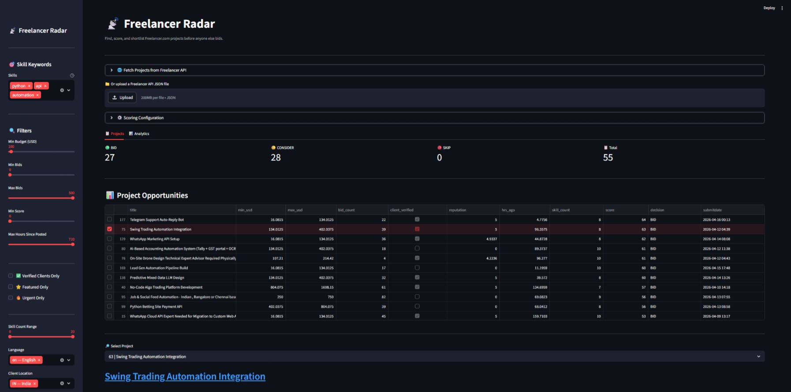
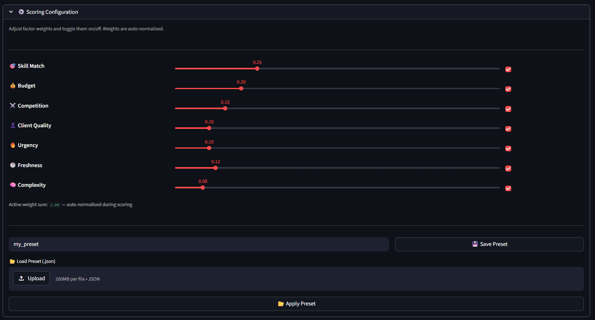
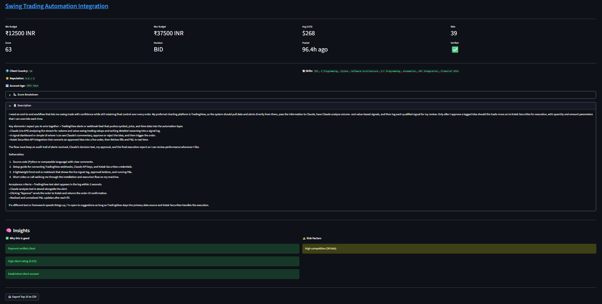
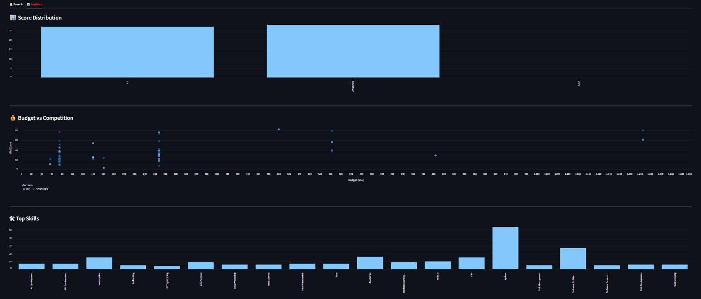

# 📡 Freelancer Radar

> **Find, score, and shortlist Freelancer.com projects before anyone else bids.**

A Streamlit dashboard that pulls live projects from the Freelancer.com API, scores them across 7 weighted factors, and surfaces the best opportunities — so you spend time bidding, not searching.


---

## 📸 Screenshots

### Project Dashboard — score, filter, and shortlist at a glance


### Scoring Configuration — tune 7 factors with live sliders


### Project Detail — insights, risk flags, and score breakdown


### Analytics Tab — score distribution, budget vs competition, top skills


---

## ✨ Features

| Feature | Description |
|---|---|
| 🔍 **Live API Fetch** | Fetch active projects directly from Freelancer.com API with country, language, and budget filters |
| 🧠 **Smart Scoring** | 7-factor weighted scoring: skill match, budget, competition, client quality, urgency, freshness, complexity |
| ⚙️ **Dynamic Scoring Config** | Adjust weights with sliders, toggle factors on/off, save/load presets as JSON |
| 📊 **Interactive Table** | Check any row to instantly load full project details |
| 🔎 **Advanced Filters** | Filter by budget (USD-normalised), bids, hours posted, client country, verified status, flags, skill count |
| 💡 **AI-Style Insights** | Per-project "Why this is good" and "Risk factors" analysis |
| 📈 **Analytics Tab** | Score distribution, budget vs competition scatter, top skills frequency |
| 💾 **Daily Cache** | Avoid redundant API calls with automatic daily caching |
| 📤 **CSV Export** | Download your top shortlisted projects directly to your browser |

---

## 🛠️ Installation

```bash
git clone https://github.com/jaydeeprusia/freelancer-radar.git
cd freelancer-radar
python -m venv venv
venv\Scripts\activate        # Windows
# source venv/bin/activate   # macOS/Linux
pip install -r requirements.txt
streamlit run app.py
```

---

## 🔑 Getting Your Freelancer Auth Token

1. Log in to [freelancer.com](https://www.freelancer.com)
2. Open DevTools → Network tab
3. Make any API request (e.g. browse projects)
4. Find a request to `api/projects` and copy the `freelancer-auth-v2` header value

> ⚠️ Never commit your token. Use the password input in the UI — it is never stored.

---

## ⚙️ Scoring System

Each project is scored across 7 factors (0–100 each), combined as a weighted sum:

| Factor | Default Weight | What it measures |
|---|---|---|
| 🎯 Skill Match | 25% | Fuzzy match of your keywords against project skills |
| 💰 Budget | 20% | USD-normalised average budget |
| ⚔️ Competition | 15% | Inverse of bid count |
| 👤 Client Quality | 15% | Verification + reputation + account age |
| 🔥 Urgency | 10% | Urgent / featured / premium flags |
| 🕐 Freshness | 10% | Hours since posted |
| 🧠 Complexity | 5% | Description length + technical keywords |

All weights are **auto-normalised** and fully adjustable via the UI. Presets can be saved and loaded as JSON downloads.

**Decision thresholds (configurable in `config.toml`):**
- `BID` → score ≥ 45
- `CONSIDER` → score ≥ 25
- `SKIP` → score < 25

---

## 📁 Project Structure

```
├── app.py              # Streamlit UI (tabs: Projects + Analytics)
├── fetcher.py          # Freelancer API client + retry logic + caching
├── utils.py            # Raw JSON → normalised DataFrame
├── scoring.py          # 7-factor scoring engine + insights generator
├── filters.py          # Advanced filtering logic
├── config.toml         # All tunable thresholds and weights
├── requirements.txt
├── tests/
│   └── test_scoring.py # pytest unit tests for all scoring functions
└── cache/              # Auto-generated daily cache (gitignored)
```

---

## 🧩 Advanced Usage

### Saving a Scoring Preset

1. Open **⚙️ Scoring Configuration**
2. Adjust sliders and toggles
3. Enter a preset name and click **💾 Save Preset** — downloads a `.json` to your browser
4. Upload it later with **📂 Load Preset** → **Apply Preset**

### Tuning Thresholds

Edit `config.toml` to change scoring tiers, decision thresholds, and API behaviour without touching code:

```toml
[scoring]
threshold_bid      = 45
threshold_consider = 25

[scoring.budget_tiers]
excellent = 500
good      = 150
```

### Uploading a JSON File

Instead of fetching live, upload a raw Freelancer API JSON response directly via the file uploader — useful for offline analysis or testing.

---

## 🔒 Security

- Auth token entered via `type="password"` field — **never stored, logged, or cached**
- No credentials hardcoded anywhere in the codebase
- Cache files contain only project data (no tokens)
- Preset files are downloaded to your browser, not saved on any server

---

## 📦 Key Dependencies

| Package | Purpose |
|---|---|
| `streamlit` | UI framework |
| `pandas` | Data manipulation |
| `requests` | API calls |
| `tenacity` | Retry with exponential backoff |
| `forex-python` | Currency conversion |
| `pycountry` | ISO country/language data |

---

## 🧪 Running Tests

```bash
pip install pytest
pytest tests/
```

---

## 🤝 Contributing

Pull requests are welcome! See [CONTRIBUTING.md](CONTRIBUTING.md) for setup and guidelines.

1. Fork the repo
2. Create a feature branch (`git checkout -b feature/amazing-feature`)
3. Commit your changes
4. Push and open a PR

---

## 📄 License

MIT — see [LICENSE](LICENSE)

---

## ⭐ Star History

If this tool saves you time finding freelance projects, please consider starring the repo!

[](https://star-history.com/#jaydeeprusia/freelancer-radar)
